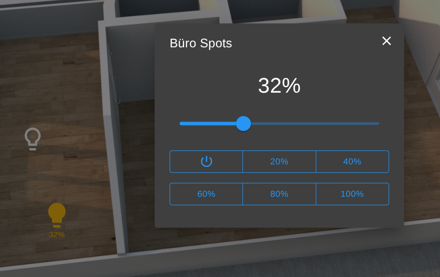
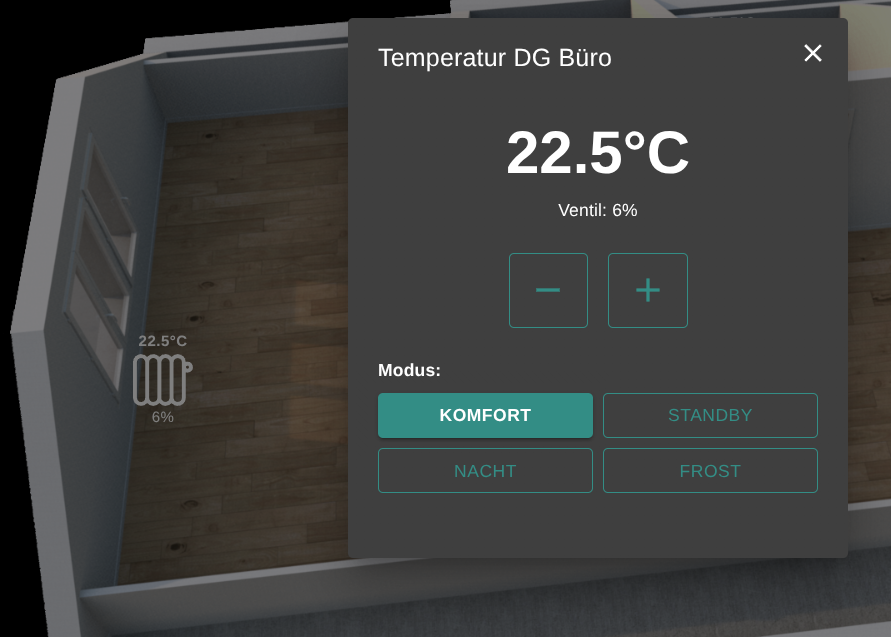
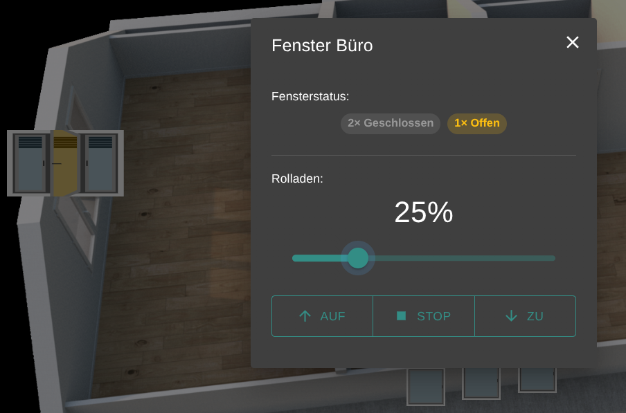
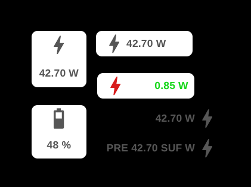

# Custom Deluxe Widgets for ioBroker.vis 2.0


[](https://www.npmjs.com/package/iobroker.vis-2-widgets-deluxe)
[](https://www.npmjs.com/package/iobroker.vis-2-widgets-deluxe)

[](https://nodei.co/npm/iobroker.vis-2-widgets-deluxe/)

## Beschreibung

Custom Widgets für ioBroker vis-2 zur Steuerung verschiedener Smart-Home-Geräte mit einem einheitlichen, flexiblen Widget.

## Installation

Installieren Sie den Adapter über die ioBroker Admin-Oberfläche oder via npm:

```bash
npm install iobroker.vis-2-widgets-deluxe
```

## Widgets

### One Icon To Rule Them All

Ein universelles Widget mit verschiedenen Modi zur Steuerung unterschiedlicher Gerätetypen:

#### Modi

**Dimmer (Dialog)**



- Dimmer-Steuerung mit Dialog-Fenster
- Slider von 0-100%
- Schnellwahl-Buttons für häufige Helligkeitsstufen
- Individuell anpassbares Icon mit Status-Anzeige

**Switch (Toggle)**

- Einfacher Ein/Aus-Schalter
- Direktes Umschalten per Klick
- Visuelle Status-Rückmeldung
- Anpassbare Icons für Ein/Aus-Zustand

**Heating (KNX)**



- Heizungssteuerung für KNX-Systeme
- Sollwert-Einstellung
- Betriebsmodus-Auswahl (Komfort, Standby, Nacht, Frost)
- Anzeige von Ist- und Solltemperatur
- Dialog mit vollständiger Steuerung

**Window/Shutter**



- Fenster- und Rolladensteuerung
- Mehrfach-Flügel-Unterstützung (1-4 Fensterflügel)
- Perspektivische Darstellung geöffneter Fenster
- Rolladen-Animation mit Lamellenvisualisierung
- KNX-kompatible Steuerung (Hoch/Runter/Stop)

**Numeric / String Display**



- Zahlen- und Textanzeige mit flexiblem Layout
- Formatierung: Dezimalstellen, Tausender-Trennzeichen, Prefix/Suffix, Unit
- **Formel-Feld** (nur Numeric): Mathematische Berechnung vor Anzeige (z.B. `x / 1000` für W→kW)
- **Text-Ausrichtung**: Links, Mitte, Rechts für beide Display-Modi
- Text-Transformation: uppercase, lowercase, capitalize
- Value-Mapping für benutzerdefinierte Anzeigewerte
- Farb-Schwellwerte: 3-Zonen Farbcodierung
- Click-Action: Navigation zu anderer View

#### Allgemeine Features

- **Anpassbares Design**: Farben, Icons, Größen
- **Echtzeit-Updates**: Sofortige Darstellung von Zustandsänderungen
- **Material-UI**: Modernes, responsives Design
- **Mehrsprachig**: Unterstützung für Deutsch und Englisch

### Hello World Widget

Demo-Widget zum Testen und als Beispiel für die Widget-Entwicklung.

## Changelog

<!--
  Placeholder for the next version (at the beginning of the line):
  ### **WORK IN PROGRESS**
-->
### 0.4.6 (2025-11-26)

- Dialog-Positionierung komplett überarbeitet: React Portal + CSS viewport-relative Positionierung für zuverlässige Darstellung in vis-2 (Mobile & Desktop)
- Dimmer-Dialog: Quick-Buttons kompakter gestaltet

### 0.4.5 (2025-11-26)

- Heating: Status-Textfarbe (Sollwert/Ventil) jetzt konfigurierbar

### 0.4.4 (2025-11-26)

- Window/Shutter: Neues Flag `noShutter` für reine Fenster-/Türkontakt-Anzeige ohne Rollladensteuerung
- Window/Shutter: Alle Farben jetzt konfigurierbar (Glas, Griff, Flügel-Rahmen, Lamellen-Schatten, Hover)

### 0.4.3 (2025-11-25)

- Minor fixes (ESLint/Prettier)

### 0.4.2 (2025-11-25)

- Numeric Display: Formel-Feld für mathematische Berechnungen (z.B. `x / 1000` für W→kW)
- Display Modi: Text-Ausrichtung (Links/Mitte/Rechts) für Numeric und String Display

### 0.4.1 (2025-11-25)

- Minor fixes (ESLint/Prettier)

### 0.4.0 (2025-11-25)

- Neue Modi: Numeric Display, String Display
- Flexible Layouts und Farb-Schwellwerte
- View-Navigation per Klick
- Dependencies aktualisiert

### 0.3.6 (2025-11-03)

- Test-Release

### 0.3.5 (2025-11-02)

- **Fix: npm Package Build korrigiert**
    - customWidgets.js wurde in v0.3.4 fehlerhaft veröffentlicht (GitHub Action Build-Fehler)
    - Vollständiger Rebuild und Re-Deploy auf npm
    - Module Federation Container jetzt korrekt

### 0.3.4 (2025-11-02)

- **Window/Shutter Mode: KNX Rolladen-Steuerung verbessert**
    - Hoch/Runter Button-Logik korrigiert (0% = Rolladen oben, 100% = Rolladen unten)
    - Dedizierte OIDs für Hoch/Runter/Stop werden präferiert verwendet (Fallback auf Position-OID)
    - Neue konfigurierbare Werte: `shutterUpValue`, `shutterDownValue`, `shutterStopValue` (default: 0/1/1 für KNX MDT)
    - Automatische Erkennung: Wenn beide OIDs identisch sind (KNX-typisch), werden unterschiedliche Werte gesendet
    - Unterstützung für KNX Single-OID Steuerung (z.B. MDT: eine OID für Hoch/Runter mit Wert 0/1)
    - Widget-Config: 3 neue Felder zur Steuerung der Befehlswerte (EN/DE Übersetzungen)
- **Dialog-UI: Zentrale Button-Styles**
    - Neue zentrale `buttonStyles.ts` für konsistente Button-Styles über alle Dialoge
    - WindowShutterDialog und DimmerDialog verwenden gemeinsame Style-Funktionen
    - Stop-Button verwendet jetzt `primaryColor` statt hartkodiertem Rot (#FF5722)
    - Reduzierte Code-Duplikation, einfachere Wartbarkeit
- **Window/Shutter Mode: Perspektivische Glas-Verzerrung bei geöffneten Fenstern**
    - Glas wird bei `state='open'` perspektivisch verzerrt (parallel zum Rahmen)
    - Gleicher `growFactor` wie Rahmen für natürliche 3D-Darstellung
    - Scharnier-abhängige Verzerrung (left/right/top hinge)
    - Verbesserte visuelle Tiefenwirkung für realistische Öffnungsdarstellung

### 0.3.3 (2025-10-23)

- Window/Shutter Mode: Vollständige Implementierung mit Rolladen- und Fenstersteuerung
- Window/Shutter Mode: Mehrfach-Flügel-Unterstützung (1-4 Fensterflügel) mit individuellen Zuständen
- Window/Shutter Mode: Perspektivische Darstellung geöffneter Fenster (nach innen öffnend)
- Window/Shutter Mode: Rolladen-Animation mit festen Lamellenhöhen (kein Stauchen/Strecken)
- Window/Shutter Mode: Intelligente Griff-Visualisierung (Drehpunkt und Rotation je nach Status)
- Window/Shutter Mode: Hybrid Alpha-Opacity-Steuerung (automatisch oder manuell via RGBA/Hex8)
- Window/Shutter Mode: Subtile Glas-Einfärbung bei geöffneten/gekippten Fenstern
- Window/Shutter Mode: Neutraler Hintergrund (kein globales Highlighting mehr)
- Code: ESLint-Fehler behoben, Return-Types hinzugefügt, Code-Qualität verbessert

### 0.3.2 (2025-10-22)

- Heating (KNX): Dialog-Beschriftungen "Valve" und "Operating Mode" nun übersetzt (DE/EN)
- Heating (KNX): Default-Modi-JSON aktualisiert (Komfort, Standby, Nacht, Frost)
- Heating (KNX): Standard-Icon auf Heizkörper-Symbol geändert
- Allgemein: Neue Einstellung "Icon-Rotation" (0-360°) für alle Modi
- Dialog: Neue Standard-Primärfarbe rgba(48,142,134,1) (Teal/Türkis)

### 0.3.1 (2025-10-22)

- Heating (KNX): Sollwertverschiebungs-Werte nun konfigurierbar (true/false, 1/0, "increase"/"decrease", etc.) - Standard: true/false
- Heating (KNX): Modi-Konfiguration erweitert - statusValue (vom OID empfangen) und controlValue (an OID senden) können nun unterschiedlich sein (rückwärtskompatibel mit "value")

### 0.3.0 (2025-10-22)

- Heating (KNX): Sollwertverschiebung vereinfacht - nur noch ein Datenpunkt
- Heating (KNX): Dropdown zeigt jetzt korrekten aktuellen Modus an
- Heating (KNX): Neue Steuerungsart "Buttons (Individual)" - einzelne Buttons für jeden Betriebsmodus mit visueller Hervorhebung des aktiven Modus

### 0.2.2 (2025-10-20)

- translations
- refactor & cleanup
- docs

### 0.2.1 (2025-10-19)

- fix deps

### 0.2.0 (2025-10-19)

- new general purpose widget >> "one icon to rule them all"
- dimmer widget removed
- refactor & cleanup

### 0.1.3 (2025-10-19)

- npm deployment adjusted

### 0.1.2 (2025-10-15)

- dimmer functional (not finished)
- card and colors fixed, better defaults
- Sizing fixen

### 0.1.1 (2025-10-12)

- Testrelease

### 0.1.0 (2024-01-XX)

- Initial release with HelloWorld widget
- Basic framework setup
- Development environment configured

## License

MIT License

Copyright (c) 2025 Your Name

Permission is hereby granted, free of charge, to any person obtaining a copy
of this software and associated documentation files (the "Software"), to deal
in the Software without restriction, including without limitation the rights
to use, copy, modify, merge, publish, distribute, sublicense, and/or sell
copies of the Software, and to permit persons to whom the Software is
furnished to do so, subject to the following conditions:

The above copyright notice and this permission notice shall be included in all
copies or substantial portions of the Software.

THE SOFTWARE IS PROVIDED "AS IS", WITHOUT WARRANTY OF ANY KIND, EXPRESS OR
IMPLIED, INCLUDING BUT NOT LIMITED TO THE WARRANTIES OF MERCHANTABILITY,
FITNESS FOR A PARTICULAR PURPOSE AND NONINFRINGEMENT. IN NO EVENT SHALL THE
AUTHORS OR COPYRIGHT HOLDERS BE LIABLE FOR ANY CLAIM, DAMAGES OR OTHER
LIABILITY, WHETHER IN AN ACTION OF CONTRACT, TORT OR OTHERWISE, ARISING FROM,
OUT OF OR IN CONNECTION WITH THE SOFTWARE OR THE USE OR OTHER DEALINGS IN THE
SOFTWARE.
